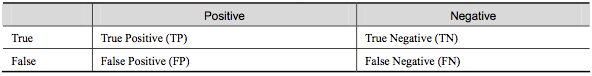

# 1.IMDB数据集

## 1.1 数据下载
1.下载地址：http://ai.stanford.edu/~amaas/data/sentiment/

2.通过TensorFlow的keras模块下载

	from imdb = keras.datasets.imdb
	# 参数 num_words=10000 会保留训练数据中出现频次在前 10000 位的字词
	(train_data, train_labels), (test_data, test_labels) = imdb.load_data(num_words=10000)

## 1.2 数据说明
IMDB 数据集，其中包含来自互联网电影数据库的 50000 条影评文本。我们将这些影评拆分为训练集（25000 条影评）和测试集（25000 条影评）。训练集和测试集之间达成了平衡，意味着它们包含相同数量的正面和负面影评。

影评分为“正面”或“负面”影评。这是一个二元分类（又称为两类分类）的示例，也是一种重要且广泛适用的机器学习问题。

# 2.THUCnews数据集

## 2.1 数据下载
THUCNews中文数据集：https://pan.baidu.com/s/1hugrfRu 密码：qfud

## 2.2 数据说明
THUCNews是根据新浪新闻RSS订阅频道2005~2011年间的历史数据筛选过滤生成，包含74万篇新闻文档（2.19 GB），均为UTF-8纯文本格式。我们在原始新浪新闻分类体系的基础上，重新整合划分出14个候选分类类别：财经、彩票、房产、股票、家居、教育、科技、社会、时尚、时政、体育、星座、游戏、娱乐。

这是一个多分类问题，可以用CNN进行处理。

# 3.评价指标

以二类分类为例  

**混淆矩阵**  
True Positive(真正，TP)：将正类预测为正类数

True Negative(真负，TN)：将负类预测为负类数

False Positive(假正，FP)：将负类预测为正类数误报 (Type I error)

False Negative(假负，FN)：将正类预测为负类数→漏报 (Type II error)

## 3.1 准确率 vs. 召回率

- 准确率(Accuracy)计算公式：

$$ACC =\frac{TP + TN}{TP + TN + FP + FN}$$

- 精确率(precision)计算公式：(针对结果集，找得对)

$$P =\frac{TP}{TP + FP}$$

- 召回率(recall)计算公式：(针对原始数据集，找得全)

$$recall =\frac{TP}{TP + FN}$$

## 3.2 ROC曲线 vs. AUC
ROC（Receiver Operating Characteristic）曲线是以假正率（FP_rate）和假负率（TP_rate）为轴的曲线，ROC曲线下面的面积我们叫做AUC. 

其中： 

1. 曲线与FP_rate轴围成的面积（记作AUC）越大，说明性能越好，即图上L2曲线对应的性能优于曲线L1对应的性能。即：曲线越靠近A点（左上方）性能越好，曲线越靠近B点（右下方）曲线性能越差。 
2. A点是最完美的performance点，B处是性能最差点。
3. 位于C-D线上的点说明算法性能和random猜测是一样的–如C、D、E点。位于C-D之上（即曲线位于白色的三角形内）说明算法性能优于随机猜测–如G点，位于C-D之下（即曲线位于灰色的三角形内）说明算法性能差于随机猜测–如F点。 
4. 虽然ROC曲线相比较于Precision和Recall等衡量指标更加合理，但是其在高不平衡数据条件下的的表现仍然过于理想，不能够很好的展示实际情况。

## 3.3 PR曲线
即 PR（Precision-Recall）曲线。 
假设 N_c>>P_c（即Negative的数量远远大于Positive的数量），若FP很大，即有很多N的sample被预测为P，因为$FP_rate =\frac{FP}{Nc}$，因此FP_rate的值仍然很小（如果利用ROC曲线则会判断其性能很好，但是实际上其性能并不好），但是如果利用PR，因为Precision综合考虑了TP和FP的值，因此在极度不平衡的数据下（Positive的样本较少），PR曲线可能比ROC曲线更实用。

## Ref：
1.[TensorFlow官方教程：影评文本分类](https://tensorflow.google.cn/tutorials/keras/basic_text_classification)

2.[CSDN博客：电影评论分类-二分类问题（IMDB数据集）](https://blog.csdn.net/Einstellung/article/details/82683652)

3.[CSDN博客：THUCNews学习（CNN模型）](https://blog.csdn.net/qq_42418416/article/details/87973149)

4.[CSDN博客：CNN字符级中文文本分类-基于TensorFlow实现](https://blog.csdn.net/u011439796/article/details/77692621)

5.[GitHub: text-classification-cnn-rnn/cnews_loader.py](https://github.com/gaussic/text-classification-cnn-rnn/blob/master/data/cnews_loader.py)

6.[慕课笔记：机器学习之类别不平衡问题 (2) —— ROC和PR曲线](https://www.imooc.com/article/48072)

7.[博客：机器学习算法中的准确率(Precision)、召回率(Recall)、F值(F-Measure)](https://www.cnblogs.com/Zhi-Z/p/8728168.html)

