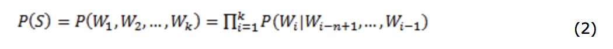

# 1.基本文本处理技能

## 1.1 分词的概念
（分词的正向最大、逆向最大、双向最大匹配法）

中文分词目前可以分为“规则分词”、“统计分词”、“混合分词（规则+统计）”三个主要流派。以下介绍下基于规则的分词。

规则分词是一种机械的分词方法，主要通过维护词典，在切分语句时，将语句的字串与词表中的词逐一进行匹配，找到则切分，否则通过增加或减少一个单字，继续比较，一直还剩下一个单字则终止，如果该单字串无法切分，则作为未登录处理。

**分词算法设计中的几个基本原则：**  
1 **颗粒度越大越好**：即单词的字数越多，所能表示的含义越确切。 如“公安局长”可以分为“公安 局长”、“公安局 长”、“公安局长”都算对，但是要用于语义分析，则“公安局长”的分词效果最好。（当然前提是所使用的词典中有这个词）

2 **切分结果中非词典词越少越好，单字字典词数越少越好**，这里的“非词典词”就是不包含在词典中的单字，而“单字字典词”指的是可以独立运用的单字，如“的”、“了”、“和”、“你”、“我”、“他”。 如"技术和服务"，可以分为“技术 和服 务”、“技术 和 服务”，但“务”字无法单独成词（即词典中没有），但“和”字可以单独成词（即词典中要包含），因此“技术 和服 务”有1个非词典词，而“技术 和 服务”有0个非词典词，因此选用后者。

3 **总体词数越少越好**：在相同字数的情况下，总词数越少，说明语义单元越少，那么相对的单个语义单元的权重会越大，因此准确性会越高。  
 

**先说说什么是最大匹配法**：最大匹配是指以词典为依据，取词典中最长单词为第一个次取字数量的扫描串，在词典中进行扫描（为提升扫描效率，还可以跟据字数多少设计多个字典，然后根据字数分别从不同字典中进行扫描）。例如：词典中最长词为“中华人民共和国”共7个汉字，则最大匹配起始字数为7个汉字。然后逐字递减，在对应的词典中进行查找。

最大匹配算法(Maximum Matching，简称MM算法)主要包括，正向最大匹配、逆向最大匹配、双向最大匹配等。 以下以“我们在野生动物园玩”为例（最大为7字词典），详细说明。

 
### 1.1.1正向最大匹配法
   分词的正向最大匹配本质是基于分治和贪婪两种算法思想。为了便于理解，以下介绍贪婪方式。  
   分治+贪婪的思想，并不一时处理全部串，而是分别处理预先设立长度的每一段，在每一段中求取最长的并且出现在字典里面的词。例如：abcdef，预先设立的最大长度为3。所以，先从串的开始截取长度为三的子串，即abc，如果abc出现在字典中，那么abc将作为分词结果，接着以相同方式处理def；如果abc没出现在字典里面，则从右边减少一个字符，再次匹配字典，即ab匹配，减少的字符将加入之前未选择的字符集里面作下一次匹配，这里是cdef，如果一个串没匹配到长度大于1的字典词，则返回最左边的字符作为该串的分词结果，也就是ab如果没有匹配到，无论a是否在字典中，都将作为分词结果。
   
   如果不设立最大处理长度，就是贪婪的思想。具体流程是先以整句为单位，就去词典匹配。如果匹配不到，则减少句子的长度进行匹配。如果匹配到，则句子的起点后移，继续递归执行，直到整个句子都被若干个词匹配中（起点超过了句子的长度）。
   
   - 第一轮  
   “我们在野生动物”，（第1轮第1次，扫描7字词典，无）  
   “我们在野生动”，（第1轮第2次，扫描6字词典，无）  
   ……  
   “我们”，（第1轮第6次，扫描2字词典，有）  
   -- *扫描中止，输出第1个词为“我们”，去除第1个词后开始第2轮扫描*  
   
   - 第二轮  
   “在野生动物园玩”，（第2轮第1次，扫描7字词典，无）  
   “在野生动物园”，（第2轮第2次，扫描6字词典，无）  
   ……  
   “在野”，（第2轮第6次，扫描2字词典，有）  
   -- *扫描中止，输出第2个词为“在野”，去除第2个词后开始第3轮扫描*
   
   - 第三轮，输出第3个词“生动”；第四轮，输出“物”，非字典词数加1；第五轮，输出“园”，单字字典数加1；第六轮，输出“玩”，单字字典数加1。 **

   - 正向最大匹配法，最终切分结果为“我们/在野/生动/物/园/玩”，其中单字字典数为2，非词典词为1。

   
  
### 1.1.2逆向最大匹配法  
 逆向即从后往前取词，其他逻辑和正向相同。
 
 - 第一轮  
   “在野生动物园玩”，（第1轮第1次，扫描7字词典，无）  
   “野生动物园玩”，（第1轮第2次，扫描6字词典，无）  
   ……  
   “玩”，（第1轮第7次，扫描2字词典，有）  
   -- *扫描中止，输出第1个词为“玩”，单字字典词加1，去除第1个词后开始第2轮扫描*  
   
   - 第二轮  
   “们在野生动物园”，（第2轮第1次，扫描7字词典，无）  
   “在野生动物园”，（第2轮第2次，扫描6字词典，无）  
   “野生动物园”，（第2轮第3次，扫描5字词典，有）  
   -- *扫描中止，输出第2个词为“野生动物园”，去除第2个词后开始第3轮扫描*
   
   - 第三轮，输出第3个词“在”，单字字典数加1；第四轮，输出“我们”。 **

   - 正向最大匹配法，最终切分结果为“我们/在/野生动物园/玩”，其中单字字典数为2，非词典词为0。

### 1.1.3双向最大匹配法  

正向最大匹配法和逆向最大匹配法，都有其局限性，因此有人提出了双向最大匹配法。即两种算法都切一遍，然后根据大颗粒度词越多越好，非词典词和单字词越少越好的原则，选择其中一种分词结果输出。  

如：“我们在野生动物园玩”  
- 正向最大匹配法，最终切分结果为：“我们/在野/生动/物/园/玩”，其中，两字词3个，单字字典词为2，非词典词为1。  
- 逆向最大匹配法，最终切分结果为：“我们/在/野生动物园/玩”，其中，五字词1个，两字词1个，单字字典词为2，非词典词为0。

非字典词：正向(1)>逆向(0)（越少越好）  
单字字典词：正向(2)=逆向(2)（越少越好）  
总词数：正向(6)>逆向(4)（越少越好）

因此最终输出为逆向结果。

### 1.1.4代码实现
在 Python 中，已经有了较好的第三方库实现了分词功能：
> 在英文文档中，最常用的是 NTLK 包，NTLK 包含了英文的停用词、分词和标注方法。  
> 
	import nltk
	word_list = nltk.word_tokenize(text) # 分词
	nltk.pos_tag(word_list) # 标注单词的词性
	
> 在中文文档中，最常用的是 jieba 包，里面包含了中文的停用词和分词方法。 
> 
	import jieba
	word_list = jieba.cut (text,cut_all=False) # 中文分词；精准模式：试图将句子最精确的切开，适合文本分析
	print("Full Mode: " + "/ ".join(word_list))

## 1.2 词、字符频率统计
（可以使用Python中的collections.Counter模块，也可以自己寻找其他好用的库）

词频统计相比字符统计而言，多了一步分词过程，代码如下。

	import collections

	# 字符统计
	text = "我爱自然语言处理。自然语言处理是一个很有意思的研究领域。"
	c = collections.Counter(text)
	print(c)

	# 词频统计
	import jieba
	seg_list = jieba.cut("我爱自然语言处理。自然语言处理是一个很有意思的研究领域。", cut_all=False)
	c = collections.Counter(list(seg_list))
	print(c)

# 2.语言模型
简单来说，语言模型（Language Model）就是用来计算一个句子的联合概率的模型，即 P(W1,W2,……,Wk)，其中Wi表示句子中的第i个词语。利用语言模型，可以确定那个词序列的可能性更大，或者给定若干个词，可以预测下一个最可能出现的词语。

那么如何计算一个句子的概率呢？给定句子（词语序列）S = W1,W2,……,Wk，它的概率可以表示为：  
  
 

从上面可以看到，一个统计语言模型可以表示成，给定前面的的词，求后面一个词出现的条件概率。

由于上式中的参数过多，存在两个问题：**自由参数数目和数据稀疏**。因此需要近似的计算方法。常见的方法有N-gram模型方法、决策树方法、最大熵模型方法、最大熵马尔科夫模型方法、条件随机域方法、神经网络方法，等等。

## 2.1 unigram、bigram、trigram的概念

  N-gram是一种基于统计语言模型的算法。它的思想是将文本里面的内容按照指定的单元进行大小为N的滑动窗口操作，每次取得长度为N的序列，直到滑窗结束。形成了长度是N的字节片段序列，每个字节片段称为gram，对所有gram的出现频度进行统计，并按照事先设定好的阈值进行过滤，形成关键gram列表，也就是这个文本的向量特征空间，列表中的每一种gram就是一个特征向量维度。

  N-gram模型也称为n-1阶马尔科夫模型，它有一个有限历史假设：当前词的出现概率仅仅与前面n-1个词相关。因此(1)式可以近似为：    
  
    **当n取1、2、3时，N-gram模型分别称为unigram、bigram和trigram语言模型。**N-gram模型的参数就是条件概率 P(Wi|Wi-n+1,...,Wi-1)。假设词表的大小为100,000，那么N-gram模型的参数数量为100,000n。

   N-gram语言模型应用非常广泛，比如输入法、语音识别等。
   
- 当 n=1 时，称为unigram（一元语言模型），即一个词的出现与周围的词是独立的，此时自由参数量级是词典大小 V。
- 当 n=2 时，称为bigram（二元语言模型），即一个词的出现仅与它前面的一个词有关，也叫一阶马尔科夫链，此时自由参数量级是 V2。
- 当 n=3 时，称为trigram（三元语言模型），即一个词的出现仅与它前面的两个词有关，也叫二阶马尔科夫链，此时自由参数量级是 V3。
- n越大，模型越准确，也越复杂，需要的计算量越大。最常用的是bigram，其次是unigram和trigram，n取≥4的情况较少。

> **建模与求解**  
> N-gram语言模型的求解跟传统统计语言模型一致，都是求解每一个条件概率的值，简单计算N元语法在语料中出现的频率，然后归一化。

## 2.2 unigram、bigram频率统计
（可以使用Python中的collections.Counter模块，也可以自己寻找其他好用的库）

### 2.2.1 N-gram实现（基于 sklearn）
详见代码：*feature-extraction-test.ipynb*

### 2.2.2 N-gram实现（基于jieba）
jieba提供很好的中文分词，但是并没有提供N-gram；sklearn的CountVectorizer能提供很好的N-gram分词，但却没有jieba那么对切词灵活，下面就介绍基于jieba分词进行N-Gram。 

详见代码：*feature-extraction-test.ipynb*

### 2.2.3 N-gram实现（基于NLTK）

# 3.文本矩阵化
（要求采用词袋模型且是词级别的矩阵化）

在自然语言处理和文本分析的问题中，词袋（Bag of Words, BOW）和词向量（Word Embedding）是两种最常用的模型。更准确地说，词向量只能表征单个词，如果要表示文本，需要做一些额外的处理。

词袋（Bag-of-words，BOW）模型，假定对于一个文档，忽略它的单词顺序和语法、句法等要素，将其仅仅看作是若干个词汇的集合，文档中每个单词的出现都是独立的，不依赖于其它单词是否出现。
（**可以看做是N-gram中的特例1元模型**）

## 3.1 step1：分词
（可采用结巴分词来进行分词操作，其他库也可以）

**jieba分词，主要算法：**
  
- 基于前缀词典实现高效的词图扫描，生成句子中汉字所有可能成词情况所构成的有向无环图 (DAG)  
- 采用了动态规划查找最大概率路径, 找出基于词频的最大切分组合  
- 对于未登录词，采用了基于汉字成词能力的 HMM 模型，使用了 Viterbi 算法

## 3.2 step2：去停用词，构造词表

关键在于停用词表的维护。有了停用词表，实际使用时，在分词之后，若分词结果中包含停用词则直接剔掉。

目前网上停用词表较多，哈工大停用词表、百度停用词表等均较常见。

但针对具体业务，可以按业务需要，专门整理对业务无帮助或无意义的词。甚至停用“句”——如针对电商的“此用户没有发表评论。”

## 3.3 step3：每篇文档的向量化

**文本向量化**：假设有m篇文章d1,d2,...dn,对它们进行分词,得到n个分词w1,w2....wn,那么Fij代表第i篇文章中分词j出现的次数,这些文章可用矩阵标识

> zhPartent = re.compile(u'[\u4e00-\u9fa5]+')  匹配中文分词

可以使用sklearn实现文档向量化

- 文档向量化（计数向量化）：sklearn.feature_extraction.text.CountVectorizer
- TFIDF向量化：sklearn.feature_extraction.text.TfidTransformer

## 3.4 完整代码示例

详见代码 *feature-extraction-test.ipynb*

## Ref：
1.[GitHub：结巴分词介绍和使用](https://github.com/fxsjy/jieba)

2.[简书：用Python实现一个词频统计(词云)图](https://www.jianshu.com/p/28718ba04bc9?from=groupmessage)

3.[博客：自然语言处理之语言模型（LM）](https://blog.csdn.net/qq_36330643/article/details/80143960)

4.[博客：NLP之语言模型](https://blog.csdn.net/miner_zhu/article/details/82729192)

5.[知乎：自然语言处理中N-gram模型介绍](https://zhuanlan.zhihu.com/p/32829048)

6.[博客：基于jieba中文分词进行N-Gram](https://blog.csdn.net/u011311291/article/details/79269931)

7.[博客：文本数据预处理：sklearn 中 CountVectorizer、TfidfTransformer 和 TfidfVectorizer](https://blog.csdn.net/m0_37324740/article/details/79411651)

8.中文分词算法分类
  

## 要求
1. 基本文本处理技能
	- 1.1 分词的概念（分词的正向最大、逆向最大、双向最大匹配法）；
	- 1.2 词、字符频率统计；（可以使用Python中的collections.Counter模块，也可以自己寻找其他好用的库）
2.  
	- 2.1 语言模型中unigram、bigram、trigram的概念；
	- 2.2 unigram、bigram频率统计；（可以使用Python中的collections.Counter模块，也可以自己寻找其他好用的库）
3. 文本矩阵化：要求采用词袋模型且是词级别的矩阵化  
步骤有：
  - 3.1 分词（可采用结巴分词来进行分词操作，其他库也可以）；
  - 3.2 去停用词；构造词表。
  - 3.3 每篇文档的向量化。