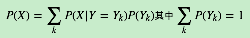
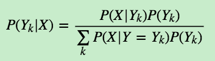

# 1.朴素贝叶斯(NB)的原理
**【对比】**  
在所有的机器学习分类算法中，朴素贝叶斯和其他绝大多数都不同。对于大多数的分类算法，比如决策树、KNN、逻辑回归、SVM等，他们都是判别方法，也就是直接学习出特征输出 Y 和特征 X 之间的关系，要么是决策函数 $Y = f(x)$，要么是条件分布 P(Y|X)；但是朴素贝叶斯是生成方法，也就是直接找出特征输出 Y 和特征 X 的联合分布 P(X, Y)，然后用  P(Y|X)= P(X, Y)/P(X)得出。

## 1.1朴素贝叶斯相关的统计学知识
贝叶斯学派的思想可以概括为 **先验概率 + 数据 = 后验概率**。也就是说我们在实际问题中需要得到的后验概率，可以通过先验概率和数据一起综合得到，而其中的先验概率一般采用假设模型，比如正态分布、beta分布等。虽然难以从严密的数学逻辑中推出贝叶斯学派的逻辑，但是在很多实际应用中，贝叶斯理论很好用，比如垃圾邮件分类、文本分类。

我们先看看条件独立公式，如果 X 和 Y 互相独立，则有：  
	　　　　P(X,Y)=P(X)P(Y)   
我们接着看看条件概率公式：  
	　　　　P(Y|X)=P(X,Y)/P(X)  
	　　　　P(X|Y)=P(X,Y)/P(Y)  
或者说:  
	　　　　P(Y|X)=P(X|Y)P(Y)/P(X)  
接着看全概率公式：  
	　　　　  
推导出贝叶斯公式：  
	　　　　

## 1.2朴素贝叶斯模型及推导过程
详见链接[朴素贝叶斯算法原理](https://www.cnblogs.com/pinard/p/6069267.html)

**【注意】**   
朴素贝叶斯假设特征之间独立。而一般情况下，样本的特征之间独立这个条件是弱成立的，所以贝叶斯是稍微牺牲了准确性，但使得模型的条件分布的计算大大简化了。		
如果特征真是非常不独立的话，那就尽量不要使用朴素贝叶斯模型了，考虑使用其他的分类方法比较好。

# 2.朴素贝叶斯的应用场景
 1. 实时预测：朴素贝叶斯算法简单便捷，因此可以用于实时进行预测。
 2. 多分类预测：适用于目标变量为多类别的任务。
 3. 文本分类/垃圾邮件过滤/情感分析：主要用于文本分类的朴素贝叶斯分类器。由于多类问题中独立规则更好，与其他算法相比具有更高的成功率， 因此，它被广泛用于垃圾邮件过滤（识别垃圾邮件）和情感分析（在社交媒体分析中，识别积极和消极的客户情绪）
 4. 推荐系统：朴素贝叶斯分类器和协作过滤一起构建推荐系统，可以使用机器学习和数据挖掘技术来过滤看不见的信息并预测用户是否会喜欢给定的资源，简单的例子就是淘宝上的商品推荐。

# 3.朴素贝叶斯优缺点

- 优点：
 	1. 朴素贝叶斯模型发源于古典数学理论，有稳定的分类效率。
 	2. 对小规模的数据表现很好，能处理多分类问题，适合增量式训练，尤其是数据量超过内存时，可以选择一批批去增量训练。
 	3. 对缺失数据不太敏感，算法逻辑简单，易于实现。
 	4. 分类过程时空开销小（假设特征相互独立，只涉及到二维存储）

- 缺点：
 	1. 朴素贝叶斯假设样本特征之间相互独立，所以特征相关性较小时，朴素贝叶斯性能最好，而特征个数比较多或特征间相关性较大时，分类效果不好。对于这一点，半朴素贝叶斯等算法通过考虑部分关联性可以适当改进。
 	2. 需要知道先验概率，而先验概率很多时候取决于假设，所以假设模型的好处会直接影响预测效果。
 	3. 由于朴素贝叶斯是通过先验概率和数据来决定后验概率，从而决定分类，所以分类决策存在一定的错误率。
 	4. 对输入数据的表达形式很敏感。

# 3.朴素贝叶斯 sklearn 参数学习

在scikit-learn中，提供了3中朴素贝叶斯分类算法：  
- GaussianNB(高斯朴素贝叶斯)  
- MultinomialNB(多项式朴素贝叶斯)  
- BernoulliNB(伯努利朴素贝叶斯)

其中GaussianNB就是先验为高斯分布的朴素贝叶斯，MultinomialNB就是先验为多项式分布的朴素贝叶斯，而BernoulliNB就是先验为伯努利分布的朴素贝叶斯。

**这三个类适用的分类场景各不相同：  
一般来说，如果样本特征的分布大部分是连续值，使用GaussianNB会比较好；如果如果样本特征的分大部分是多元离散值，使用MultinomialNB比较合适；而如果样本特征是二元离散值或者很稀疏的多元离散值，应该使用BernoulliNB。**

## 3.1 高斯朴素贝叶斯

sklearn.naive_bayes.GaussianNB(priors=None)  

- 参数说明：
	- priors：获取各个类标记对应的先验概率  

## 3.2 多项式朴素贝叶斯

sklearn.naive_bayes.MultinomialNB(alpha=1.0, fit_prior=True, class_prior=None)  
主要用于离散特征分类，例如文本分类单词统计，以出现的次数作为特征值

- 参数说明：  
	- alpha：浮点型，可选项，默认1.0，添加拉普拉修/Lidstone平滑参数  
	- fit_prior：布尔型，可选项，默认True，表示是否学习先验概率，参数为False表示所有类标记具有相同的先验概率  
	- class_prior：类似数组，数组大小为(n_classes,)，默认None，类先验概率

## 3.2 伯努利朴素贝叶斯

sklearn.naive_bayes.BernoulliNB(alpha=1.0, binarize=0.0, fit_prior=True,class_prior=None)  
类似于多项式朴素贝叶斯，也主要用户离散特征分类；  

和MultinomialNB的区别是：MultinomialNB以出现的次数为特征值，BernoulliNB为二进制或布尔型特性。

- 参数说明：
 - binarize：将数据特征二值化的阈值

## 3.3 代码实现
**

# 4.利用朴素贝叶斯模型结合 TF-IDF 算法进行文本分类

处理流程一般为：
	
>提取特征数据集 标签 并向量化  
>选择合适的分类器构建模型  
>对模型进行验证

	from sklearn.datasets import fetch_20newsgroups
	from sklearn.cross_validation import cross_val_score
	from sklearn.feature_extraction.text import CountVectorizer
	from sklearn.feature_extraction.text import TfidfVectorizer
	import matplotlib.pyplot as plt
	from sklearn.naive_bayes import MultinomialNB
	 
	news=fetch_20newsgroups(subset='all')
	X,Y=news.data,news.target
	k=list(range(10000,180000,10000))
	k_count_score=[]
	k_tfidf_score=[]
	
	for i in k:
	    #tfidf分类器
	    tfidf=TfidfVectorizer(analyzer='word',stop_words='english' ,max_features=i)
	    X_tfidf=tfidf.fit_transform(X)
	    mnb_tfidf=MultinomialNB()
	    scores_tfidf=cross_val_score(mnb_tfidf,X_tfidf,Y,cv=10,scoring='accuracy')
	    score_tfidf=scores_tfidf.mean()
	    k_tfidf_score.append(score_tfidf)
	    
	    #tf分类器
	    count=CountVectorizer(analyzer='word',stop_words='english' ,max_features=i)
	    X_count=count.fit_transform(X)
	    mnb_count=MultinomialNB()
	    scores_count=cross_val_score(mnb_count,X_count,Y,cv=10,scoring='accuracy')
	    score_count=scores_count.mean()
	    print(score_count)
	    d=()
	    d=X_count.get_shape()
	    print("维数",d[1])
	    k_count_score.append(score_count)
	    
	plt.xlabel('dimension')
	plt.ylabel('accuracy')
	plt.plot(k,k_count_score)
	plt.plot(k,k_tfidf_score,color='red')
	plt.legend()
	plt.show()

---------------------------------------
## Ref：
1.[CSDN：sklearn：朴素贝叶斯（naïve beyes）](https://blog.csdn.net/u013710265/article/details/72780520)

2.[博客：朴素贝叶斯算法原理小结](https://www.cnblogs.com/pinard/p/6069267.html)

3.[sklearn朴素贝叶斯类库使用小结](https://blog.csdn.net/kancy110/article/details/72763276)

4.[博客：使用朴素贝叶斯进行中文文本分类](https://www.cnblogs.com/d0main/p/6914742.html)

5.[CSDN：利用TfidfVectorizer+朴素贝叶斯进行文本分类](https://blog.csdn.net/zhuisaozhang1292/article/details/81448040)

## 要求
*https://shimo.im/docs/yBTvDTmqSCwtlvdo*

1. 朴素贝叶斯的原理
2. 朴素贝叶斯应用场景
3. 朴素贝叶斯优缺点
4. 朴素贝叶斯 sklearn 参数学习
5. 利用朴素贝叶斯模型结合 Tf-idf 算法进行文本分类
