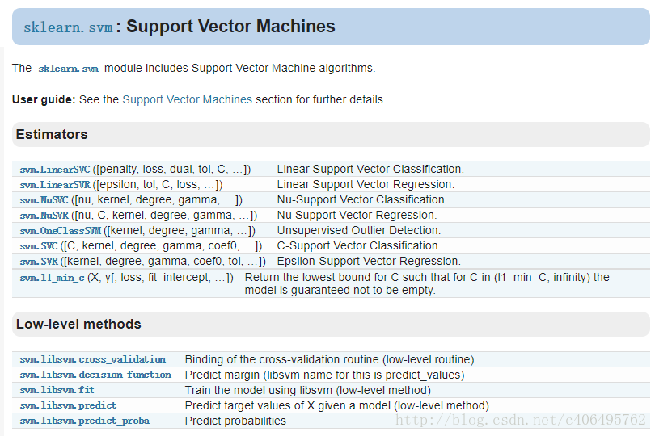

# 1. SVM的原理

SVM（Support Vector Machine）支持向量机，简单来说是一个分类器，并且是二分分类器。

给定训练样本，SVM 建立一个超平面作为决策曲面，使得正例和反例的隔离边界最大化。

**概述一下：**  
当一个分类问题，数据（**data**）是线性可分的，也就是用一根棍（**classifier**）就可以将两种小球分开的时候，我们只要将棍的位置放在让小球距离棍的距离（**margin**）最大化的位置即可，寻找这个最大间隔的过程（**trick**），就叫做最优化（**optimization**）。  
但是，现实往往是很残酷的，一般的数据是线性不可分的，也就是找不到一个棍将两种小球很好的分类。这个时候，我们就需要像大侠一样，将小球拍起，用一张纸代替小棍将小球进行分类。想要让数据飞起，我们需要的东西就是核函数（**kernelling**），用于切分小球的纸，就是超平面（**hyperplane**）。
离这个超平面最近的样本点就是SVM中的支持样本点（Support Vector），称为“支持向量”。

一个最优化问题通常有两个基本因素：1.目标函数，也就是希望什么东西的什么指标达到最好； 2.优化对象，你期望通过改变哪些因素来使得你的目标函数达到最优。  
在线性SVM算法中，目标函数是“分类间隔”，而优化对象则是决策面；

**如果集合中任意2个元素连线上的点也在集合中，那么这个集合就是凸集。**  
**凸函数的定义也是如此，其几何意义表示为函数任意两点连线上的值大于对应自变量处的函数值。**

# 2. SVM应用场景
适用情景：  
SVM最基本的应用是分类。  
SVM在很多数据集上都有优秀的表现。  
相对来说，SVM尽量保持与样本间距离的性质导致它抗攻击的能力更强。  
和随机森林一样，这也是一个拿到数据就可以先尝试一下的算法。

# 3. SVM优缺点
高准确率，为避免过拟合提供了很好的理论保证，而且就算数据在原特征空间线性不可分，只要给个合适的核函数，它就能运行得很好。在动辄超高维的文本分类问题中特别受欢迎。可惜内存消耗大，难以解释，运行和调参也有些烦人，而随机森林却刚好避开了这些缺点，比较实用。

- 优点
	- 1. 可以解决高维问题，即大型特征空间；
	- 2. 能够处理非线性特征的相互作用；
	- 3. 无需依赖整个数据；
	- 4. 可以提高泛化能力；
	- 5. 需要对数据提前归一化，很多人使用的时候忽略了这一点，毕竟是基于距离的模型，所以LR也需要归一化

- 缺点
	- 1. 当观测样本很多时，效率并不是很高；
	- 2. 一个可行的解决办法是模仿随机森林，对数据分解，训练多个模型，然后求平均，时间复杂度降低p倍，分多少份，降多少倍；
	- 3. 对非线性问题没有通用解决方案，有时候很难找到一个合适的核函数；
	- 4. 对缺失数据敏感；
	- 5.对于核的选择也是有技巧的（libsvm中自带了四种核函数：线性核、多项式核、RBF以及sigmoid核）：
		- 第一，如果样本数量小于特征数，那么就没必要选择非线性核，简单的使用线性核就可以了；
		- 第二，如果样本数量大于特征数目，这时可以使用非线性核，将样本映射到更高维度，一般可以得到更好的结果；
		- 第三，如果样本数目和特征数目相等，该情况可以使用非线性核，原理和第二种一样。
		- （对于第一种情况，也可以先对数据进行降维，然后使用非线性核，这也是一种方法。）

# 4. SVM sklearn 参数学习
sklearn.svm模块提供了很多模型供我们使用。  

## SVC
**SVC用于分类**：支持向量分类，基于libsvm实现的，数据拟合的时间复杂度是数据样本的二次方，这使得他很难扩展到10000个数据集，当输入是多类别时（SVM最初是处理二分类问题的），通过一对一的方案解决，当然也有别的解决办法。

## NuSVC
**NuSVC（Nu-Support Vector Classification.）**：核支持向量分类，和SVC类似，也是基于libsvm实现的，但不同的是通过一个参数空值支持向量的个数。

## LinearSVC
**LinearSVC（Linear Support Vector Classification）**：线性支持向量分类，类似于SVC，但是其使用的核函数是”linear“上边介绍的两种是按照brf（径向基函数计算的，其实现也不是基于LIBSVM，所以它具有更大的灵活性在选择处罚和损失函数时，而且可以适应更大的数据集，他支持密集和稀疏的输入是通过一对一的方式解决的。

# 5. 利用SVM模型结合TF-IDF算法进行文本分类

01分类：

	import pandas as pd
	from sklearn.feature_extraction.text import TfidfVectorizer
	from sklearn.linear_model import LogisticRegression
	from sklearn.naive_bayes import MultinomialNB
	from sklearn.svm import SVC
	from sklearn.metrics import accuracy_score , roc_auc_score , roc_curve
	import matplotlib.pyplot as plt
	 
	 
	 
	def create_model(d_train , d_test):
	    print("训练样本 = %d" % len(d_train))
	    print("测试样本 = %d" %len(d_test))
	    vectorizer = TfidfVectorizer(ngram_range=(1,2),min_df=2 ) #tf-idf特征抽取ngram_range=(1,2)
	    features = vectorizer.fit_transform(d_train.title)
	    print("训练样本特征表长度为 " + str(features.shape))
	    # print(vectorizer.get_feature_names()[3000:3050]) #特征名展示
	    test_features = vectorizer.transform(d_test.title)
	    print("测试样本特征长度为："+str(test_features.shape))
	    #支持向量机
	    #C: 目标函数的惩罚系数C，用来平衡分类间隔margin和错分样本的，default C = 1.0
	    svmmodel = SVC(C = 1.0 , kernel= "linear") #kernel：参数选择有rbf, linear, poly, Sigmoid, 默认的是"RBF";
	 
	    nn = svmmodel.fit(features , d_train.two_category)
	    print(nn)
	    # predict = svmmodel.score(test_features ,d_test.two_category)
	    # print(predict)
	    pre_test = svmmodel.predict(test_features)
	    d_test["01category"] = pre_test
	    d_test.to_excel("wr01_pre_1025.xlsx", index=False)
	 
	 
	 
	# d_train , d_test = data_prepare()
	print("对新样本进行01预测")
	df = pd.read_excel("wr01_new_train1012.xlsx") #训练
	d_train = df
	 
	d_test = pd.read_excel("wr_100样本1023.xlsx") #测试
	create_model(d_train, d_test)

60分类：
	import pandas as pd
	from sklearn.feature_extraction.text import TfidfVectorizer
	from sklearn.linear_model import LogisticRegression
	from sklearn.naive_bayes import MultinomialNB
	from sklearn.svm import SVC
	from sklearn.metrics import accuracy_score , roc_auc_score , roc_curve
	import matplotlib.pyplot as plt
	from sklearn.model_selection import train_test_split
	 
	 
	 
	def create_model(d_train , d_test):
	    print("训练样本 = %d" % len(d_train))
	    print("测试样本 = %d" %len(d_test))
	    vectorizer = TfidfVectorizer(ngram_range=(1,2),min_df=2 ) #tf-idf特征抽取ngram_range=(1,2)
	    features = vectorizer.fit_transform(d_train.title)
	    print("训练样本特征表长度为 " + str(features.shape))
	    # print(vectorizer.get_feature_names()[3000:3050]) #特征名展示
	    test_features = vectorizer.transform(d_test.title)
	    print("测试样本特征表长度为 "+ str(test_features.shape))
	    #支持向量机
	    #C: 目标函数的惩罚系数C，用来平衡分类间隔margin和错分样本的，default C = 1.0
	    svmmodel = SVC(C = 1.0 , kernel= "linear") #kernel：参数选择有rbf, linear, poly, Sigmoid, 默认的是"RBF";
	 
	    nn = svmmodel.fit(features , d_train.sku)
	    print(nn)
	    # predict = svmmodel.score(test_features ,d_test.sku)
	    # print(predict)
	    pre_test = svmmodel.predict(test_features)
	    d_test["pre_skuno"] = pre_test
	    d_test.to_excel("wr60_svm_pre1012.xlsx", index=False)
	 
	print("对新样本进行60个车型预测")
	d_train = pd.read_excel("wr60_train1012.xlsx") #训练
	 
	df = pd.read_excel("wr机器学习分析报告.xlsx",sheetname="01预测") #测试
	d_test = df[df.pre_category == 1]
	create_model(d_train, d_test)
	 
	# 训练样本 = 75987
	# 测试样本 = 32606
	# 训练样本特征表长度为 (75987, 18040)
	# SVC(C=1.0, cache_size=200, class_weight=None, coef0=0.0,
	#   decision_function_shape=None, degree=3, gamma='auto', kernel='linear',
	#   max_iter=-1, probability=False, random_state=None, shrinking=True,
	#   tol=0.001, verbose=False)
	# 0.920137398025
	#0.933329022245

---------------------------------------
## Ref：
1.[CSDN：几个常用算法的适应场景及其优缺点（非常好）](https://blog.csdn.net/u010159842/article/details/52918815)

2.[知乎：各种机器学习算法的应用场景分别是什么](https://www.zhihu.com/question/26726794)

3.[CSDN：svm小结](https://blog.csdn.net/win_in_action/article/details/50716865)

4.[CSDN：python机器学习库sklearn——支持向量机svm](https://blog.csdn.net/luanpeng825485697/article/details/79809006)

5.[sklearn官网例子](https://scikit-learn.org/stable/modules/feature_extraction.html#tfidf-term-weighting)

## 要求
*https://shimo.im/docs/g2Mmblb132UcFyz5*

1. SVM的原理
2. SVM应用场景 
3. SVM优缺点 
4. SVM sklearn 参数学习 
5. 利用SVM模型结合 Tf-idf 算法进行文本分类