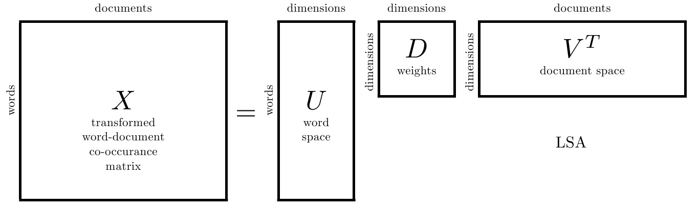
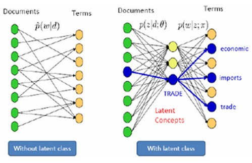

# 1. pLSA、共轭先验分布；LDA主题模型原理

## 1.1 LSA原理

LSA(latent semantic analysis)潜在语义分析，也被称为 LSI(latent semantic index)，是 Scott Deerwester, Susan T. Dumais 等人在 1990 年提出来的一种新的**索引和检索方法**。该方法和传统向量空间模型(vector space model)一样，使用向量来表示词(terms)和文档(documents)，并通过向量间的关系(如夹角)来判断词及文档间的关系；不同的是，LSA 将词和文档映射到**潜在语义空间**，从而去除了**原始向量空间**中的一些“噪音”，提高了信息检索的精确度。  

LSA的基本思想就是，将document从稀疏的高维Vocabulary空间映射到一个低维的向量空间，我们称之为隐含语义空间(Latent Semantic Space).

如何得到这个低维空间呢，和PCA采用特征值分解的思想类似，作者采用了奇异值分解(Singular Value Decomposition)的方式来求解Latent Semantic Space。

## 1.2 pLSA原理

类似于LSA的思想，在pLSA中也引入了一个Latent class，但这次要用概率模型的方式来表达LSA的问题。  

## 1.3 共轭先验分布

**共轭分布(conjugacy)**：后验概率分布函数与先验概率分布函数具有相同形式。用公式来表示就是：后验概率∝ 似然函数*先验概率

采用共轭先验的原因：

>可以使得先验分布和后验分布的形式相同，这样一方面合符人的直观（它们应该是相同形式的），另外一方面是可以形成一个先验链，即现在的后验分布可以作为下一次计算的先验分布，如果形式相同，就可以形成一个链条。

## 1.4 LDA主题模型原理

隐含狄利克雷分布(Latent Dirichlet Allocation，以下简称LDA)。LDA模型如下图。

理解LDA主题模型的主要任务就是理解上面的这个模型。这个模型里，我们有M个文档主题的Dirichlet分布，而对应的数据有M个主题编号的多项分布，这样(α→θd→z⃗ d)就组成了Dirichlet-multi共轭，可以使用前面提到的贝叶斯推断的方法得到基于Dirichlet分布的文档主题后验分布。

由于主题产生词不依赖具体某一个文档，因此文档主题分布和主题词分布是独立的。理解了上面这M+K组Dirichlet-multi共轭，就理解了LDA的基本原理了。

LDA是一种三层贝叶斯模型，三层分别为：文档层、主题层和词层。该模型基于如下假设：

1）整个文档集合中存在k个互相独立的主题；  
2）每一个主题是词上的多项分布；  
3）每一个文档由k个主题随机混合组成；  
4）每一个文档是k个主题上的多项分布；  
5）每一个文档的主题概率分布的先验分布是Dirichlet分布；  
6）每一个主题中词的概率分布的先验分布是Dirichlet分布。  

# 2. LDA应用场景

1) 文本聚类/分类、语义分析  
主题是聚类中心，文章和多个类簇（主题）关联

2) 特征生成(分类算法的输入)  
LDA可以生成特征供其他机器学习算法使用；LDA为每一篇文章推断一个主题分布；K个主题即是K个数值特征。  
用于逻辑回归、决策树、svm等分类算法的预测任务

3) 降维  
每篇文章在主题上的分布提供了一个文章的简洁总结

4) 推荐系统  
将文章主题作为用户的特征

# 3. LDA优缺点

有了主题模型，我们该怎么使用它呢？它有什么优点呢？我总结了以下几点：

　　1)它可以衡量文档之间的语义相似性。对于一篇文档，我们求出来的主题分布可以看作是对它的一个抽象表示。对于概率分布，我们可以通过一些距离公式（比如KL距离）来计算出两篇文档的语义距离，从而得到它们之间的相似度。

　　2)它可以解决多义词的问题。“苹果”可能是水果，也可能指苹果公司。通过我们求出来的“词语－主题”概率分布，我们就可以知道“苹果”都属于哪些主题，就可以通过主题的匹配来计算它与其他文字之间的相似度。

　　3)它可以排除文档中噪音的影响。一般来说，文档中的噪音往往处于次要主题中，我们可以把它们忽略掉，只保持文档中最主要的主题。

　　4)它是无监督的，完全自动化的。我们只需要提供训练文档，它就可以自动训练出各种概率，无需任何人工标注过程。

　　5)它是跟语言无关的。任何语言只要能够对它进行分词，就可以进行训练，得到它的主题分布。

# 4. LDA参数学习
在scikit-learn中,LDA主题模型的类在sklearn.decomposition.LatentDirichletAllocation包中，其算法实现主要基于原理篇里讲的变分推断EM算法，而没有使用基于Gibbs采样的MCMC算法实现。

我们来看看LatentDirichletAllocation类的主要输入参数:

1) **n_topics**: 即我们的隐含主题数K,需要调参。K的大小取决于我们对主题划分的需求，比如我们只需要类似区分是动物，植物，还是非生物这样的粗粒度需求，那么K值可以取的很小，个位数即可。如果我们的目标是类似区分不同的动物以及不同的植物，不同的非生物这样的细粒度需求，则K值需要取的很大，比如上千上万。此时要求我们的训练文档数量要非常的多。

2) **doc_topic_prior**:即我们的文档主题先验Dirichlet分布θd的参数α。一般如果我们没有主题分布的先验知识，可以使用默认值1/K。

3) **topic_word_prior**:即我们的主题词先验Dirichlet分布βk的参数η。一般如果我们没有主题分布的先验知识，可以使用默认值1/K。

4) **learning_method**: 即LDA的求解算法。有 ‘batch’ 和 ‘online’两种选择。 ‘batch’即我们在原理篇讲的变分推断EM算法，而"online"即在线变分推断EM算法，在"batch"的基础上引入了分步训练，将训练样本分批，逐步一批批的用样本更新主题词分布的算法。默认是"online"。选择了‘online’则我们可以在训练时使用partial_fit函数分布训练。不过在scikit-learn 0.20版本中默认算法会改回到"batch"。建议样本量不大只是用来学习的话用"batch"比较好，这样可以少很多参数要调。而样本太多太大的话，"online"则是首先了。

5）**learning_decay**：仅仅在算法使用"online"时有意义，取值最好在(0.5, 1.0]，以保证"online"算法渐进的收敛。主要控制"online"算法的学习率，默认是0.7。一般不用修改这个参数。

6）**learning_offset**：仅仅在算法使用"online"时有意义，取值要大于1。用来减小前面训练样本批次对最终模型的影响。

7）**max_iter** ：EM算法的最大迭代次数。

8）**total_samples**：仅仅在算法使用"online"时有意义， 即分步训练时每一批文档样本的数量。在使用partial_fit函数时需要。

9）**batch_size**: 仅仅在算法使用"online"时有意义， 即每次EM算法迭代时使用的文档样本的数量。

10）**mean_change_tol** :即E步更新变分参数的阈值，所有变分参数更新小于阈值则E步结束，转入M步。一般不用修改默认值。

11）**max_doc_update_iter**: 即E步更新变分参数的最大迭代次数，如果E步迭代次数达到阈值，则转入M步。

　从上面可以看出，如果learning_method使用"batch"算法，则需要注意的参数较少，则如果使用"online",则需要注意"learning_decay", "learning_offset"，“total_samples”和“batch_size”等参数。无论是"batch"还是"online", n_topics(K), doc_topic_prior(α), topic_word_prior(η)都要注意。如果没有先验知识，则主要关注与主题数K。可以说，主题数K是LDA主题模型最重要的超参数。

# 5. 使用LDA生成主题特征，在之前特征的基础上加入主题特征进行文本分类

## 5.1 LDA的Python实现

在实际的运用中，LDA可以直接从 *gensim* 调，主要的一些参数有如下几个：

- corpus：语料数据，需要包含单词id与词频
- num_topics：我们需要生成的主题个数（重点调节）
- id2word：是一种id到单词的映射（gensim也有包生成）
- passes：遍历文本的次数，遍历越多越准备
- alpha：主题分布的先验
- eta：词分布的先验

接下来，我们实战一把，直接用其官方的示例

	from gensim.test.utils import common_texts
	from gensim.corpora.dictionary import Dictionary

	# Create a corpus from a list of texts
	common_dictionary = Dictionary(common_texts)
	common_corpus = [common_dictionary.doc2bow(text) for text in common_texts]
	
	# Train the model on the corpus.
	lda = LdaModel(common_corpus, num_topics=10)

一步步拆解来看，首先common_texts是list形式，里面的每一个元素都可以认为是一篇文档也是list结构： 

	>>> print type(common_texts)
	<type 'list'>
	>>> common_texts[0]
	['human', 'interface', 'computer']

第二步，doc2bow这个方法用于将文本转化为词袋形式，看一个官方的示例大家应该就能明白了， 

	>>> from gensim.corpora import Dictionary
	>>> dct = Dictionary(["máma mele maso".split(), "ema má máma".split()])
	>>> dct.doc2bow(["this", "is", "máma"])
	[(2, 1)]
	>>> dct.doc2bow(["this", "is", "máma"], return_missing=True)
	([(2, 1)], {u'this': 1, u'is': 1})

初始化的时候对每一个词都会生成一个id，新的文本进去的时候，返回该文本每一个词的id，和对应的频数，对于那些不存在原词典的，可以控制是否返回。此时生成的corpus就相当于是LDA训练模型的输入了，让我们检查一下：

	>>>common_corpus[0]
	[(0, 1), (1, 1), (2, 1)]
	# human单词的id为0，且在第一个文档中只出现了一次

最后一步，我们只需调用LDA模型即可，这里指定了10个主题。
from gensim.models import LdaModel
lda = LdaModel(common_corpus, num_topics=10)

让我们检查一下结果（还有很多种方法大家可以看文档），比如我们想看第一个主题由哪些单词构成：

	>>>lda.print_topic(1, topn=2)
	'0.500*"9" + 0.045*"10"

可以看出第一个模型的词分布，9号10号占比较大（这里topn控制了输出的单词个数，对应的单词可以通过之前生成dict找出）
我们还可以对刚才生成的lda模型用新语料去进行更新， 

	# 能更新全部参数
	lda.update(other_corpus)
	#还能单独更新主题分布， 输入为之前的参数，其中rho指学习率
	lda.update_alpha(gammat, rho)
	#还能单独更新词分布
	lda.update_eta(lambdat, rho)

大家可以根据自己的实际业务需求，来具体查验所需函数，这里就不一一展开了，官方文档上也写的比较细。

## 5.2 LDA模型中的主题个数
这里扩展开来谈一点，我们如何确定LDA模型中的主题个数，因为这也是我们调参的重点，该参数选取的恰当，那我们模型的效果往往会变好。首先还是熟悉的套路，交叉验证，28，37分看数据量，而我们的评估指标，我翻了一圈，大家都是用的困惑度（perplexity），其定义为：

其中为文档的总数，为文档中单词所组成的词袋向量，为模型所预测的文档的生成概率，为文档中单词的总数。简单理解一下就是，对于一篇文章，我们的模型有多不确定它是属于哪一个主题的。很自然，主题越多，肯定困惑度越小，但是不要忘了，计算性能也扛不住啊，因此，一般也是会在合理的主题范围内去挑选一个最佳的主题个数，比如画topic_number-perplexity曲线（跟K-means）去找最佳的K一样的理念吧。还有其他大佬，融入了分层狄利克雷过程（HDP），构成一种非参数主题模型，好处就是不需要预先指定个数，模型可以随着文档的变化而自动的对主题个数进行调整。这里还要再提醒一点，也是看知乎上小伙伴上提醒的，千万不要用gensim中的log_perplexity()计算的perplexity指标来比较topic数量的好坏！因为这个函数没有对主题数目做归一化，因此不同的topic数目不能直接比较！

---------------------------------------
## Ref：
1.**[博客：文本主题模型之LDA(一) LDA基础](https://www.cnblogs.com/pinard/p/6831308.html)**

2.**[博客：用scikit-learn学习LDA主题模型](https://www.cnblogs.com/pinard/p/6908150.html)**

3.[博客：通俗理解LDA主题模型](https://www.cnblogs.com/jhcelue/p/7148935.html)

4.[segmentfault：一文详解LDA主题模型](https://segmentfault.com/a/1190000012215533?utm_source=tag-newest)

5.[NLP︱LDA主题模型的应用难题、使用心得及从多元统计角度剖析](https://blog.csdn.net/sinat_26917383/article/details/52233341)

## 要求
*https://shimo.im/docs/aI8m5XZzdHwxhpLy*

1. pLSA、共轭先验分布；LDA主题模型原理
2. LDA应用场景 
3. LDA优缺点 
4. LDA参数学习 
5. 使用LDA生成主题特征，在之前特征的基础上加入主题特征进行文本分类